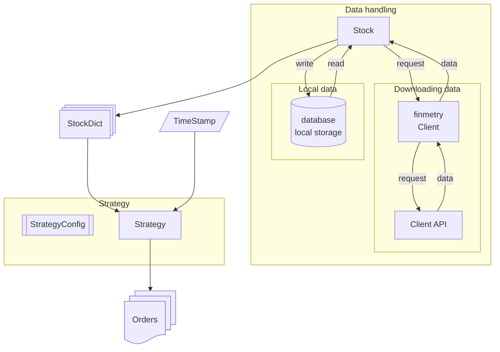

# Finmetry

**This project is developed for my personal use.** I am developing this to keep the documentation, architecture and pipeline consistent so that I can focus more on developing strategies instead of developing pipelines.

Visit [Finmetry](https://dev-ddr.github.io/finmetry/) guide for further steps.

# Overview

Finmetry majorly consists of 5 modules. Each module responsible for various aspects of the fin-quant pipeline.

1. [Client handling module](https://dev-ddr.github.io/finmetry/concepts/client_handling_module/) :- Handles APIs of different clients. These clients are often the stock brokers like 5paisa, zerodha, dhan etc. This module bridges the client-API and the finmetry API. The major responsibility of this module is to download the stocks data, which can be historical or live.

1. [Stocks handling module](https://dev-ddr.github.io/finmetry/concepts/stocks_handling_module/) :- Responsible for handling the stocks level data. The *client handling module* works with the Stocks object. The Stocks object carries necessary information about the underlying security. This information is used by other modules for their tasks. This module also contains *StockDict* object which is kind of a data container to handle multiple stocks. All other modules in this project works with *StockDict* object. For eg., the *client handling module* gets the underlying stocks information from *StockDict* objext which it uses further to download the live/historical data about each stock. 

1. [Strategy handling module](https://dev-ddr.github.io/finmetry/concepts/strategy_handling_module/) :- The strategy is formed from *StockDict* and *StrategyConfig* modules. The *StockDict* objet tell "on which stock or on which all stocks the stretegy runs". This is for initializing the strategy. For running the strategy, a timestamp is only required. For a given timestamp, the strategy computes various parameters and outputs the *orders*.

1. [Portfolio module](https://dev-ddr.github.io/finmetry/concepts/portfolio_handling/) :- The portfolio module is responsible for generating the report of the strategy. In live environment, this module also performs the actual actions with the client.

1. [Backtester module](https://dev-ddr.github.io/finmetry/concepts/backtesting/) :- Backtests the strategy by going through the data like in an actual environment. This module loops from start-time to end-time and obtains the orders from the strategy and gives it to the portfolio. The portfolio at the end of the loop generates the report.

Below figure shows the framework overview uptill getting the orders from the strategy.

> This project is solely developed for my personal use. I am publishing this only to keep myself updated and to remove the headache of setting up the framework again and again.

