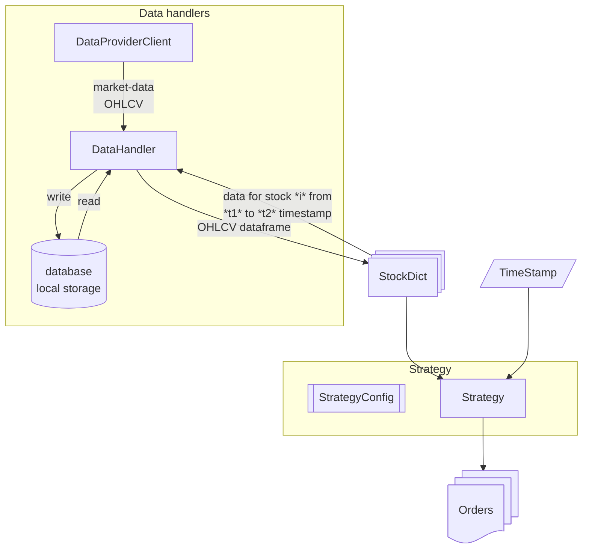

# Finmetry

**This project is developed for my personal use.** I am developing this to keep the documentation, architecture and pipeline consistent so that I can focus more on developing strategies instead of developing pipelines.

Visit [Finmetry](https://dev-ddr.github.io/finmetry/) guide for further steps.

# Overview

Finmetry majorly consists of 5 modules. Each module responsible for various aspects of the fin-quant pipeline.

1. [Data handling module](https://dev-ddr.github.io/finmetry/concepts/data_handling_module/) :- Responsible for downloading and managing the data locally. Furthermore, this pipeline is responsible for providing data to *stocks module* when requested.

1. [Stocks module](https://dev-ddr.github.io/finmetry/concepts/stocks_module/) :- Responsible for handling the stocks level data. The *data handling module* works with the Stocks object. The Stocks object carries necessary information about the underlying security. This information is used by other modules for their tasks. For eg., the *data handling module* uses the information about the stocks class to download the live/historical data about the stock.

1. [Strategy module](https://dev-ddr.github.io/finmetry/concepts/strategy_module/) :- The strategy is fromed from *Stocks* and *StrategyConfig* modules. For a given timestamp, the strategy computes various parameters and outputs the *orders*.

1. [Portfolio module](https://dev-ddr.github.io/finmetry/concepts/portfolio_handling/) :- The portfolio module is responsible for generating the report of the strategy. In live environment, this module also performs the actual actions with the client.

1. [Backtester module](https://dev-ddr.github.io/finmetry/concepts/backtesting/) :- Backtests the strategy by going through the data like in an actual environment. This module loops from start-time to end-time and obtains the orders from the strategy and gives it to the portfolio. The portfolio at the end of the loop generates the report.

Below figure shows the framework overview uptill getting the orders from the strategy.

> This project is solely developed for my personal use. I am publishing this only to keep myself updated and to remove the headache of setting up the framework again and again.

