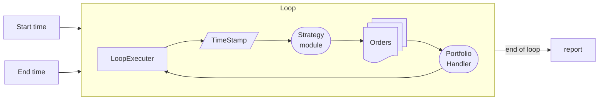

## Backtester

```mermaid

flowchart LR

subgraph loop["Loop"]
direction LR
lex@{ shape: rect, label: "LoopExecuter" } -->
ts@{ shape: lean-r, label: "TimeStamp" } -->
stg([Strategy <br> module]) --> 
orders@{ shape: docs, label: "Orders" } -->
ptf([Portfolio <br> Handler]) --> lex
end

t1[Start time] --> loop
t2["End time"] --> loop
loop --"end of loop"--> report
```
