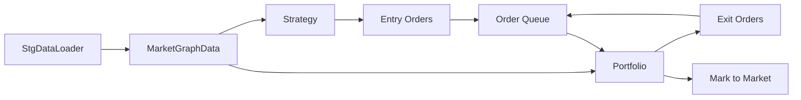
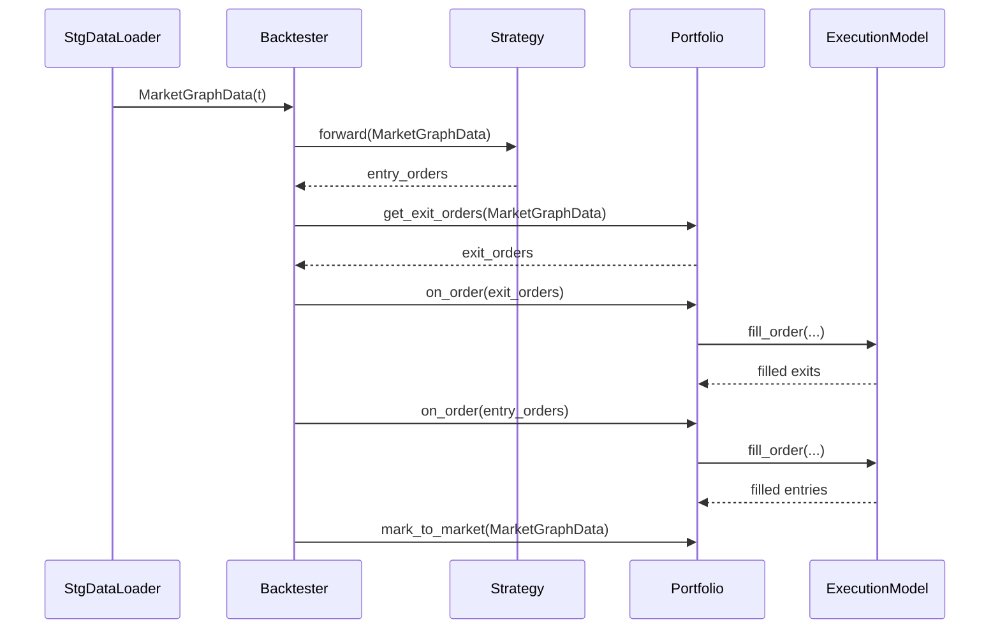

## Backtester – Concepts

The Backtester is the **orchestrator** of the entire system. It does not contain trading logic, feature logic, or execution logic. Its sole responsibility is to **coordinate the interaction** between data, strategy, portfolio, and execution in a strictly ordered loop.

> The backtester defines *when* things happen, never *how* they happen.


## Core Responsibility

At every timestamp, the backtester enforces the following invariant order:

1. Observe market state
2. Ask strategy for new orders
3. Ask portfolio for exit orders
4. Execute orders
5. Mark portfolio to market

No step is optional. No step is reordered.


## High-level Control Flow




## Event-driven View




## Ordering Guarantees (Critical)

### Exit Orders Before Entry Orders

Exit orders are **always executed before** new entry orders:

```python
all_orders = exit_orders + entry_orders
```

This guarantees:

* cash from exits is available for new entries
* no artificial `NegativeCashError`
* deterministic capital reuse

This is a **design rule**, not an optimization.


## What the Backtester Does NOT Do

The Backtester deliberately avoids:

* feature computation
* trading decisions
* order sizing
* execution modeling
* portfolio accounting

All such logic is delegated to specialized modules.


## Determinism & Reproducibility

Given:

* a deterministic `StgDataLoader`
* a deterministic `Strategy`
* a deterministic `ExecutionModel`

The backtest result is **fully reproducible**.

The Backtester itself introduces **no randomness**.

## Mental Model

Think of the Backtester as a **clock-driven state machine**:

* Time advances via `StgDataLoader`
* Decisions come from `Strategy`
* State lives in `Portfolio`
* Reality is simulated by `ExecutionModel`

The backtester only keeps time moving.


## Summary

* Backtester is a coordinator, not a logic holder
* Enforces strict ordering per timestamp
* Guarantees exit-before-entry execution
* Preserves determinism and replayability

This separation is intentional and foundational to the system.

