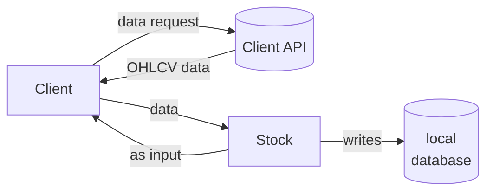

# Client handling module

The most important part of the algo trading project is the data. For this I am using third party API to donwload the data. Moreover, these APIs can also provide the interfact to place the order on the market. But right now, I will only focus on data downloading part.

There are few data providers like *yfinance* which are free. Also, there are other clients or say brokers which provides the API for placing orders which also provides historical data, like [5paisa](https://pypi.org/project/py5paisa/0.2.9/), [zeroda](https://kite.trade/docs/pykiteconnect/v4/), [dhan](https://pypi.org/project/dhanhq/) etc. These clients provides the data to their customers free of cost (as far as I know). For this you need to have a Demat account with them. Anyways, I have a demat account on *5paisa* and thus I have developed a client using *py5paisa* api.



Different clients may have different connection methods. Here, I will show you to how I connect with [py5paisa](https://pypi.org/project/py5paisa/0.2.9/). I keep the API-secrets in `yaml` config files. I read that and pass it to the `Client` object. Here is how the config looks like.

```yaml
account_holder_name: "asdfasdfasdv"
cred:
  APP_NAME: "asdfasasdfadfas"
  APP_SOURCE: "asdfasdfsadfa"
  USER_ID: "asdfasdasdfafasdf"
  PASSWORD: "asdfasdfaasfassdf"
  USER_KEY: "asdfasdghfgfasdf"
  ENCRYPTION_KEY: "asdasfgfasdfacvdsf"
client_code: 'asdfaasfgasdcasc'
mpin: '496165216546'
```

## Loggin-in to the client

Even with the loaded `creds`, we still need to pass `totp`. You can get it from a linked authenticator app.

```python
client = fm.clients.client_5paisa.Client5paisa(totp=input("give totp from the autheticator app: "), **creds)
```

## Downloading Data

```python
symbol = "IDEA"
start_date, end_date = "2018-01-01", "2026-01-14"
interval = fm.constants.INTERVAL.one_day

s1 = fm.Stock(symbol)
data = client.download_historical_data(s1,start=start_date, end=end_date, interval=interval)
data.info()
```

    <class 'pandas.core.frame.DataFrame'>
    DatetimeIndex: 1992 entries, 2018-01-01 00:00:00 to 2026-01-14 09:15:00
    Data columns (total 5 columns):
     #   Column  Non-Null Count  Dtype  
    ---  ------  --------------  -----  
     0   Open    1992 non-null   float64
     1   High    1992 non-null   float64
     2   Low     1992 non-null   float64
     3   Close   1992 non-null   float64
     4   Volume  1992 non-null   int64  
    dtypes: float64(4), int64(1)
    memory usage: 93.4 KB


> Note that this is one_day interval data.


