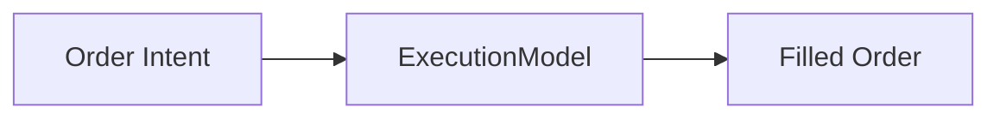

## Execution Boundary



Before execution:

* `price` is intent
* `value_frac` expresses capital allocation

After execution:

* `fill_price`, `fill_qty`, `total_cost`, `brokerage_cost` are finalized


## Naive Execution Model (Current Implementation)

The current `ExecutionModel` implements a **deterministic, immediate fill** model:

* buy orders consume a fraction of available cash
* sell orders liquidate the full quantity
* fills occur at `order.price`
* no slippage, no latency, no volume constraints

This is intentional and serves as a **baseline**.


## Buy vs Sell Semantics

### Buy Orders

```text
available_cash × value_frac
        ↓
   total_cost (incl. brokerage)
        ↓
   net_cost / fill_price
        ↓
      fill_qty
```

* Cash constraint is enforced here
* Quantity is derived, not specified

### Sell Orders

* Quantity is already known
* Execution determines net receivable after brokerage


## Determinism Guarantee

Given the same:

* order
* available cash
* execution model parameters

Execution is **fully deterministic**.

This is critical for:

* reproducible backtests
* debugging strategy behavior
* regression testing


## Separation from Portfolio

The Executioner:

* DOES fill orders
* DOES compute costs
* DOES model market noise

The Portfolio:

* DOES NOT simulate markets
* DOES NOT apply slippage
* DOES NOT guess fill quantities

This separation avoids hidden coupling and keeps accounting clean.


## Extensibility: Live Trading & Advanced Models

The `ExecutionModel` is designed to be **subclassed**:

* live broker APIs
* limit/market order books
* volume‑weighted execution
* latency and queue priority models

The Backtester and Portfolio remain unchanged.

> Swapping execution models does not affect strategy or portfolio code.


## Typical Market Noises (not implemented)

Typical execution‑level failures:

* insufficient liquidity
* rejected orders
* partial fills
* delayed execution

These belong **only** in the Executioner layer and must be surfaced via filled order metadata.


## Mental Model

Think of the Executioner as a **market adapter**:

* Strategy says *what it wants*
* Executioner decides *what actually happens*


## Summary

* Executioner simulates market reality
* Only source of execution noise
* Deterministic by default
* Fully swappable for live trading

This module is the bridge between research and reality.
