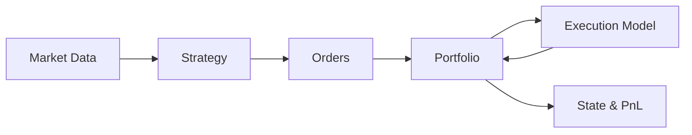

# Architecture

For algo-trading/ quant-trading, the first thing required is the **strategy**. To develop a strategy we will need to *evaluate* it and for that we will have to **backtest** it. Moreover, we need the **data** for all this. The finmetry library provides the backbone of the strategy development pipeline.

The finmetry library takes care of :-
- downloading the stocks data using the client API
- storing the data and retrieving from it efficiently
- backtesting the strategy
- generating the report of the backtest

## Concepts Overview

> This project is developed for my personal use.

This section explains **how finmetry is structured** and **why it is structured this way**.

If you are looking for examples or code you can run immediately, go to **Getting Started**.
If you want to understand the system well enough to extend it safely, read this section carefully.

## What is finmetry?

`finmetry` is a **research‑first quantitative trading framework**.

Its primary goals are:

* correctness over convenience
* reproducibility over flexibility
* clear separation of responsibilities
* identical abstractions for backtesting and live trading

It is **not** a strategy library and **not** a signal generator.
It is a framework for expressing, testing, and executing trading ideas without mixing concerns.

## The Core Idea

Every trading system—no matter how complex—can be reduced to this loop:

```text
Market Data → Strategy → Orders → Portfolio → Execution → Accounting
```

finmetry enforces this loop explicitly.

Each box is a **separate module**, with strict rules about what it can and cannot do.
If you violate these rules, your results become unreliable.

---

## High‑Level Architecture



This architecture is **deliberate**:

* Strategies are stateless and blind to execution
* Execution simulates (or connects to) market reality
* Portfolio is kind of a report card of the strategy
* Backtesting is just orchestration

## The Major Concepts

Each page in this section focuses on **one responsibility**.

### Client

Handles interaction with external systems:

* broker APIs
* live data feeds
* authentication and credentials

This module exists so that **core logic remains broker‑agnostic**.

### Stocks

Responsible for:

* symbol management
* downloading historical data
* storing and loading OHLCV

No strategy logic lives here.

### Strategy

Strategies:

* takes in **immutable market snapshots** as its input
* inspect pre‑computed features
* and emits **order intent only** which is an `Order` object

They do **not**:

* manage positions
* know available cash
* simulate fills

This makes strategies testable, comparable, and reusable.

### Orders

Orders are the **contract** between strategy, portfolio, and execution.

They represent *intent*, not outcome.

Execution fills them.
Portfolio accounts for them.

Because orders persist end‑to‑end, every trade is auditable.


### Executioners

Execution models answer one question:

> *What happens when this order meets the market?*

They handle:

* slippage
* brokerage
* partial fills
* live broker integration

Swapping execution models does **not** change strategy code.

### Portfolio

The Portfolio is the **state machine** of the system.

It tracks:

* cash
* positions
* open orders
* realized and unrealized PnL

It is the **only component allowed to mutate state**.

### Backtesting

The Backtester is intentionally boring.

It:

* iterates over time
* calls the strategy
* processes orders
* updates the portfolio

It contains **no trading logic**.


## Why This Structure Is Strict

This design prevents common research errors:

* look‑ahead bias
* hidden execution assumptions
* strategy‑specific accounting hacks
* backtests that cannot go live

## Final Note

> This project is developed with personal use in mind.

I am doing this so that next time whenever I have any idea, I can simply write the strategy code only and **finmetry** will take care of backtesting it.