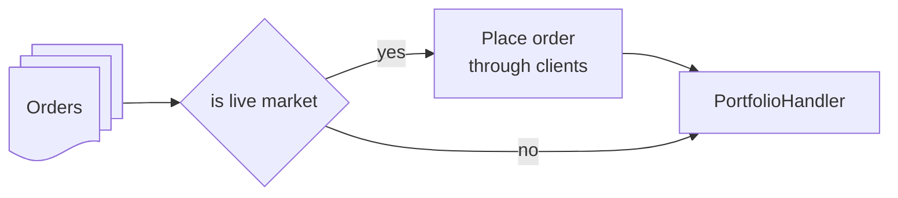

## Portfolio handler

```mermaid

flowchart LR

orders@{ shape: docs, label: "Orders" } --> 
iflv@{ shape: diamond, label: "is live market" } --yes--> od[Place order <br> through clients] -->
ph1[PortfolioHandler]
iflv --"no"--> ph1

```
