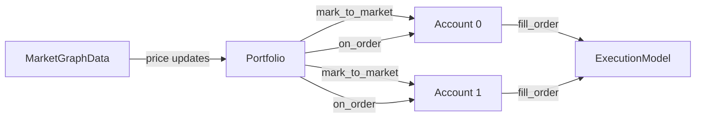
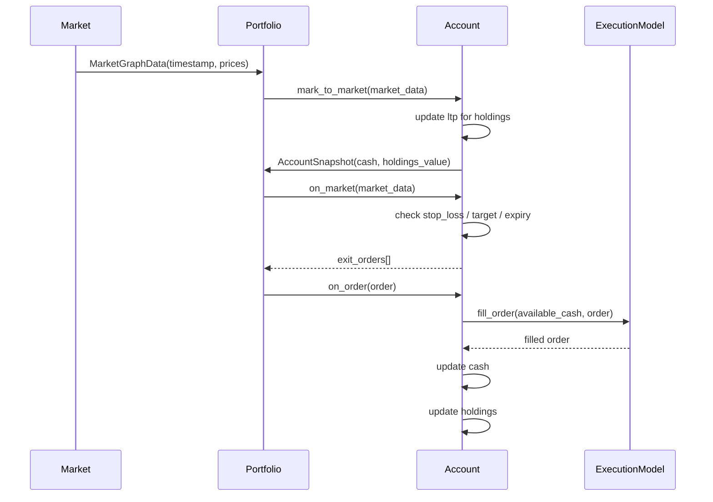
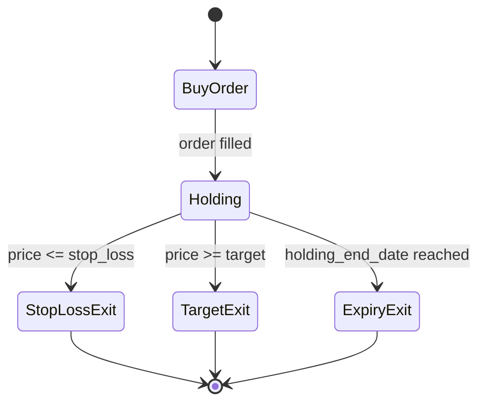
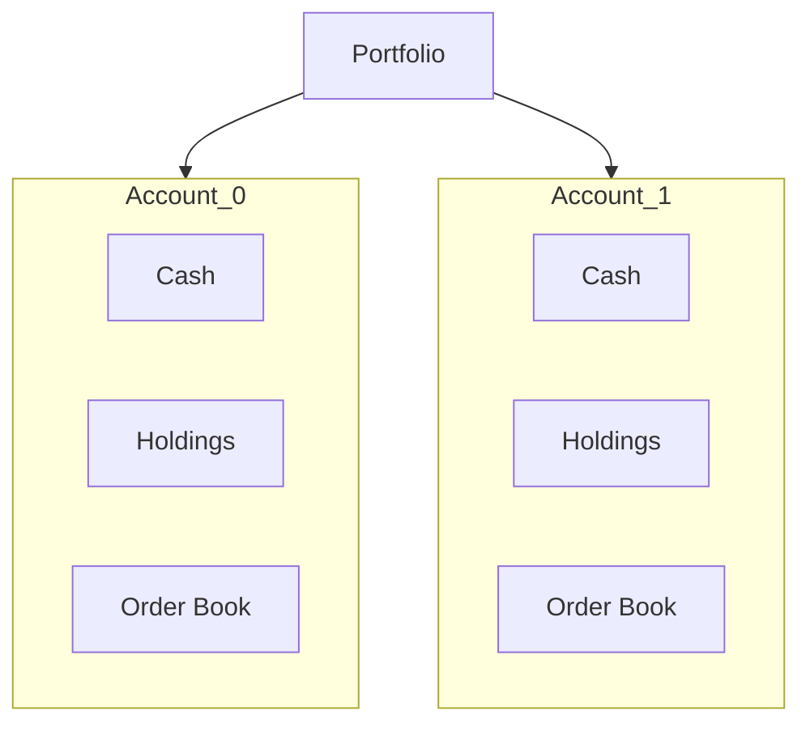
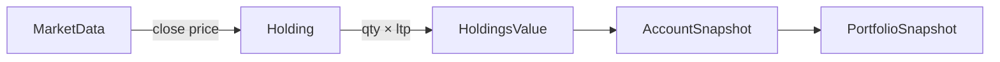

# Portfolio handler

This section explains how the **Portfolio**, **Account**, and **ExecutionModel** interact during a backtest. I have only impemented the *Portfolio* class with backtest in mind. I have not yet thought on how will this be used in live.

*Portfolio* consists of multiple *Acoounts*. These accounts are predetermined by strategy. It is the responsibility of the Strategy to tell the number of accounts and also the account index for each order. The job of *Portfolio* class is then to maintain the registry of past orders, current holdings, valuations etc. Also, the exit conditions (which is specified in the Order) are also checked by *Portfolio* class on each market data.


## High‑level Architecture




**Key idea**:
Portfolio is only a **coordinator**. All cash, holdings, and PnL logic live inside individual Accounts.


## Portfolio → Account Lifecycle


Notes:

- on_market is a pure decision step: no cash or holdings mutation

- Exit orders reuse the original order_id, enforcing strict position pairing

- Actual state changes happen only in on_order

## Order Flow (Buy → Hold → Exit)



Each holding is **keyed by order_id**, enforcing:

* No partial exits on the same order
* Clean buy → sell pairing


## Multi‑Account Isolation



**Invariant**:
Accounts never share cash, holdings, or orders. Portfolio aggregates **value only**, nothing else.


## Mark‑to‑Market Logic



Portfolio value at time *t*:

```
Σ (account.cash + account.holdings_value)
```

## Design Guarantees

* **Deterministic accounting**: cash is updated immediately on fill
* **Strict position pairing**: buy & sell share the same `order_id`
* **Account‑level isolation**: enables parallel strategies
* **Portfolio‑level aggregation**: clean performance reporting

This structure intentionally avoids hidden state and cross‑account leakage.


---