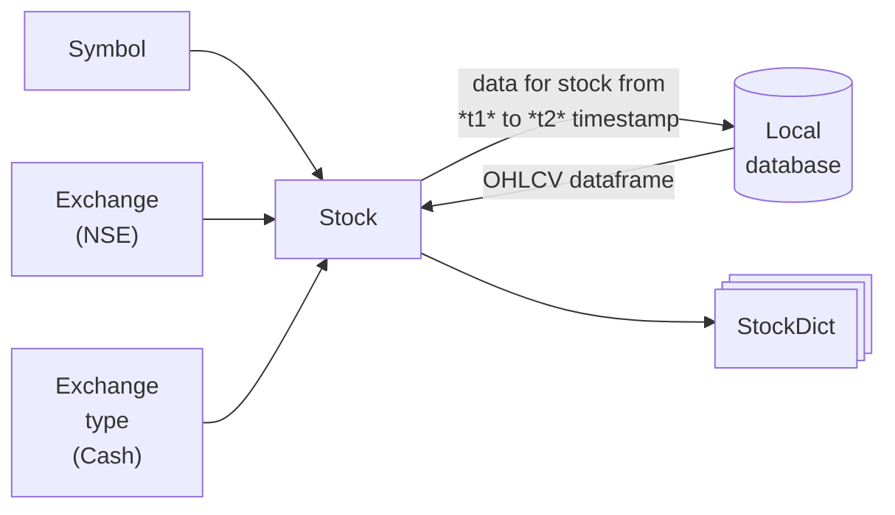

## Stocks module

The *Stock* object is the core class handling the data read/write. Multiple **Stocks** object can be combined into one **StockDict** object which is kind of a dataholder.



The **Stock** object takes in the input of `Exchange` and `Exchange_type`, which tells the type of the security. The *Stock* object handles the reading and writing of the data to the local database. The *Stock* class uses *duckdb* for managing database with `.parquet` files. This enables quicker read/write.

# Saving the data

 > The `local_data_foldpath` should be the path to the parent folder. The *Stock* object takes care of making a subdirectory within this foldpath.

```python
s1.save_historical_data(data=data, interval=interval, local_data_foldpath=local_data_foldpath, overwrite=False)
```
The data is saved as month wise files.

# Loading the data from local storage

You don't need to log-in the client to read from local data. In a way, this enables us to download the data independently of the strategies. The strategy only needs to interact with the local data.

```python
start_date, end_date = "2025-01-01", "2026-01-14"
interval = fm.constants.INTERVAL.one_day

data = s1.load_historical_data(start=start_date, end=end_date, interval=interval, local_data_foldpath=local_data_foldpath)
data.info()
```

    <class 'pandas.core.frame.DataFrame'>
    DatetimeIndex: 258 entries, 2025-01-01 to 2026-01-13
    Data columns (total 5 columns):
     #   Column  Non-Null Count  Dtype  
    ---  ------  --------------  -----  
     0   Open    258 non-null    float64
     1   High    258 non-null    float64
     2   Low     258 non-null    float64
     3   Close   258 non-null    float64
     4   Volume  258 non-null    int64  
    dtypes: float64(4), int64(1)
    memory usage: 12.1 KB
