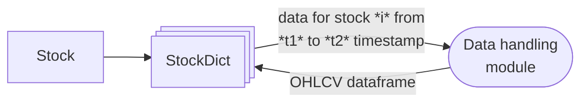

## Stocks module

```mermaid

flowchart LR

st1[Stock] -->
sd1@{ shape: procs, label: "StockDict"}
dhm([Data handling <br> module])

sd1 --data for stock *i* from <br>*t1* to *t2* timestamp--> dhm
dhm --OHLCV dataframe--> sd1

```