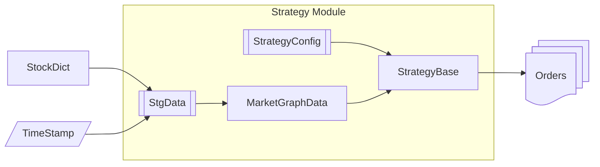
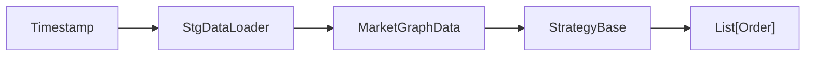
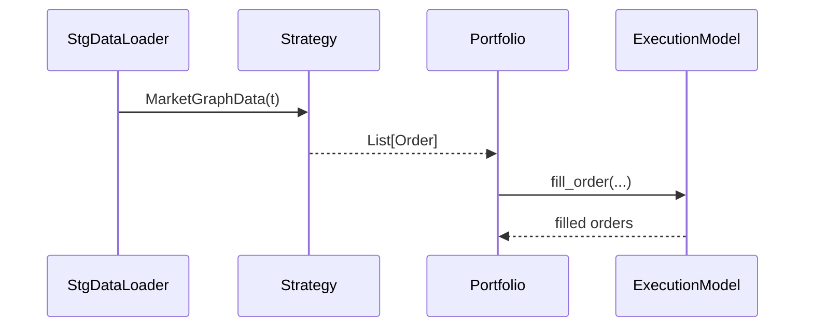

I also took help of ChatGPT to generate the document for me. You can also read it for extra context, [here](#chatgpt-generated-document-for-extra-context).

## Strategy module

You may think that this module would be the longest or the most important one. But surprisingly, this was the most easiest of all. I simply had to make few abstract classes to define the protocol. So, let's get on to that:-



The core idea is that
> The strategy shall take in the market-data (mostly with computed features) and output the order.

So, let's first go to *data* part

## StgData:- Strategy related Data computation

I took motivation from [PyG](https://pytorch-geometric.readthedocs.io/en/latest/get_started/introduction.html) for structuring the data. I am assuming that the all the information required to any strategy can be represented as a *Graph*. The StgData is simply a protocol with `__getitem`, `__len__`, and `__iter__` methods. You have to implement them according to the need of your strategy.

The protocol dictates that, `__getitem__` must take `timestamp: str|datetime` as an input and should output `MarketGraphData`. **You should keep all your strategy feature computations inside this class.**

### MarketGraphData:- Data holder of the market

The market data for a given *timestamp* is structured as a *Graph*. The nodes in the *Graph* are individual *StockData* objects (coming to that in a minute), and the relation between any two stocks can be represented by a directed graph-edge. Moreover, there is also *global_features* which can hold market-level features.

```python
@dataclass(frozen=True, slots=True)
class MarketGraphData:
    ### the time of the data. The StockData could have historical data upto this timestamp.
    timestamp: datetime|np.datetime64
    ### nodes, named after its symbol
    stocks: Dict[str, StockData]
    ### edges: (src, dst) --> edge feature vector. from one node to other.
    edges: Optional[DiEdgeData] = None
    ### optional global features (VIX, index returns, liquidity, etc.)
    global_features: Optional[Dict[str, np.ndarray]] = None
```

### StockData:- Data holder for indiividual Stock

The data and features for individual stocks are stored in *StockData* object. It holds the OHLCV values for a given timestamps along with the features required for the strategy.

```python
@dataclass(frozen=True, slots=True)
class StockData:
    symbol: str
    ### market data entry
    timestamp: datetime | np.datetime64
    open: float
    high: float
    low: float
    close: float
    volume: float
    ### anything else you want
    features: Optional[Dict[str, np.ndarray]] = None
```

### DiEdgeData:- Stock-Stock relations

DiEdgeData holds the features of stock-stock relationship. Note that, this is the directed edge.

```python
@dataclass(frozen=True, slots=True)
class DiEdgeData:
    start_node_symbol: str
    end_node_symbol: str
    features: Optional[Dict[str, np.ndarray]] = None
```

## StrategyBase

I took motivation from [pytorch.nn.Module](https://docs.pytorch.org/docs/stable/generated/torch.nn.Module.html) and designed the protocol for *StrategyBase*. This class only have one method `forward`, which only inputs`MArketGraphData` and outputs `List[Orders]`. You can design your strategy any how, but you must follow the rule for `forward` method to make your strategy compatible with backtesting pipeline of Finemtry.


# Joining all togather

The *StgData* takes in the timestamp and outputs the *MarketGraphData* which contains all the necessary information required for strategy. The logic or using the *MarketGraphData* lies inside the `forward` method of*StrategyBase* which will take it as an input and output the list of *Order*s for that timestamp.


---
---

# ChatGPT generated document (for extra context)

## Strategy Module – Concepts

I took motivation from [pytorch.nn.Module](https://docs.pytorch.org/docs/stable/generated/torch.nn.Module.html) and designed the protocol for *StrategyBase*.


The Strategy module is intentionally **minimal**. Its job is not to manage positions, cash, or execution details, but to define a **clear contract** between *market data* and *trading intent*.

A strategy answers only one question:

> **Given the market state at time *t*, what orders do I want to place?**

---

## High‑level Idea



* **StgDataLoader** builds strategy‑specific market representations
* **MarketGraphData** is the *only* input to a strategy
* **StrategyBase** converts market state into **order intent**

No execution, no fills, no portfolio state.

---

## Strategy Input: Market‑Derived, Stateless

I took motivation from [PyG](https://pytorch-geometric.readthedocs.io/en/latest/get_started/introduction.html) for structuring the data. I am assuming that the all the information required to any strategy can be represented as a *Graph*.

### StgDataLoader (Strategy Data Loader)

`StgDataLoader` defines the **data boundary** of a strategy.

It is a protocol that must implement:

* `__getitem__(timestamp)` -> outputs `MarketGraphData`. This method gives the data to Strategy, Backtester, and Portfolio.
* `__len__()` -> used by backtester to know available timestemps
* `__iter__()` -> used by backtester to iterate over data

**Responsibilities**:

* Load raw market data (prices, volumes, relations)
* Compute all strategy‑specific features
* Return a complete, immutable market snapshot

**Non‑responsibilities**:

* Portfolio state
* Positions
* Orders
* Cash

> All feature engineering lives here.

---

## MarketGraphData: Immutable Market Snapshot

`MarketGraphData` represents the entire market at a given timestamp as a **graph**.

```python
@dataclass(frozen=True, slots=True)
class MarketGraphData:
    timestamp: datetime | np.datetime64
    stocks: Dict[str, StockData]
    edges: Optional[DiEdgeData] = None
    global_features: Optional[Dict[str, np.ndarray]] = None
```

* **Nodes** → individual stocks
* **Edges** → stock‑stock relationships (directed)
* **Global features** → market‑level signals (index returns, VIX, liquidity)

This object is **read‑only** and must be safe to replay.

---

### StockData: Per‑Stock Information

```python
@dataclass(frozen=True, slots=True)
class StockData:
    symbol: str
    timestamp: datetime | np.datetime64
    open: float
    high: float
    low: float
    close: float
    volume: float
    features: Optional[Dict[str, np.ndarray]] = None
```

Holds OHLCV data and any stock‑level features required by the strategy.

---

### DiEdgeData: Stock‑Stock Relations

```python
@dataclass(frozen=True, slots=True)
class DiEdgeData:
    start_node_symbol: str
    end_node_symbol: str
    features: Optional[Dict[str, np.ndarray]] = None
```

Used to encode directed relationships such as:

* lead‑lag effects
* sector influence
* correlation‑based edges

---

## Strategy Decision Surface

### StrategyBase

`StrategyBase` defines the **only decision surface** of the strategy.

```python
class StrategyBase(ABC):
    def __call__(self, data: MarketGraphData) -> List[Order]:
        return self.forward(data)

    @abstractmethod
    def forward(self, data: MarketGraphData) -> List[Order]:
        pass
```

* Input: `MarketGraphData`
* Output: `List[Order]`

Nothing else.

> A strategy expresses *what it wants to do*, never *how it is executed*.

---

## Orders as Strategy Intent

An `Order` emitted by a strategy represents **intent**, not execution.

The strategy:

* does **not** know fill price
* does **not** know fill quantity
* does **not** model slippage or brokerage

It only specifies *desired action and risk constraints*.

### Responsibility Split

| Field                       | Strategy | Execution |
| --------------------------- | -------- | --------- |
| symbol                      | ✓        |           |
| order_type                  | ✓        |           |
| price (intent)              | ✓        |           |
| target / stop_loss / expiry | ✓        |           |
| account_idx                 | ✓        |           |
| fill_price                  |          | ✓         |
| fill_qty                    |          | ✓         |
| brokerage                   |          | ✓         |

This separation keeps backtests reproducible and live trading realistic.

---

## Strategy Rules (Contract)

A valid strategy:

* MUST be deterministic given `MarketGraphData`
* MUST return `List[Order]`
* MAY return an empty list
* MUST NOT depend on portfolio cash or positions
* MUST NOT mutate global state

Violating these rules breaks backtesting correctness.

---

## End‑to‑End Control Flow



The Strategy module stops at **order emission**. Everything after that belongs to Portfolio and Execution.

---

## Summary

* Strategy input is **pure market state**
* Strategy output is **order intent**
* No execution, no positions, no cash
* Clean separation enables reliable backtesting and live parity

This minimal contract is deliberate and non‑negotiable.

