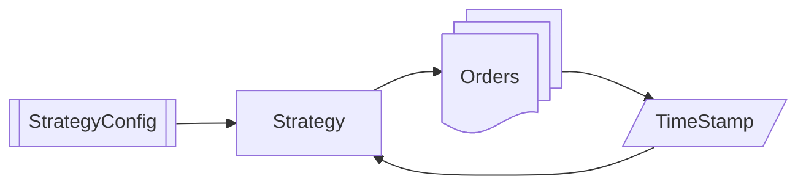

## Strategy module

```mermaid

flowchart LR

sconfig[[StrategyConfig]]
stg1[Strategy]
orders@{ shape: docs, label: "Orders" }
stginput@{ shape: lean-r, label: "TimeStamp" }

sconfig --> stg1
stg1 --> orders
orders --> stginput
stginput --> stg1

```
