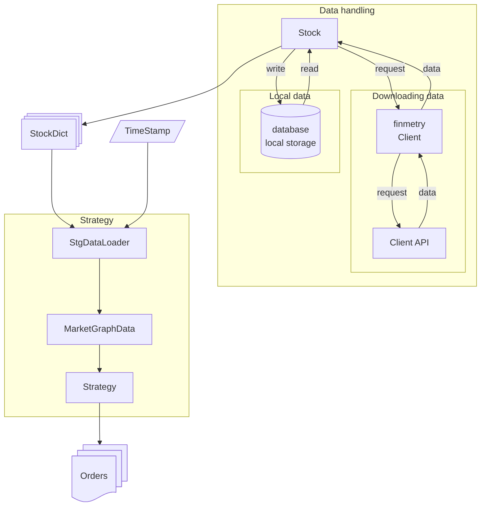
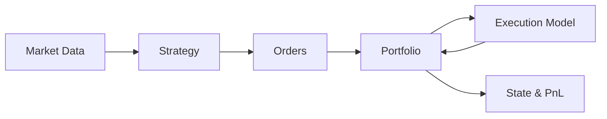

# Finmetry

**This project is developed for my personal use.** I am developing this to keep the documentation, architecture and pipeline consistent so that I can focus more on developing strategies instead of developing pipelines.




> This project is solely developed for my personal use. I am publishing this only to keep myself updated and to remove the headache of setting up the framework again and again.

---

**Finmetry is a research-first quantitative trading framework** designed to keep
strategy logic, execution logic, and accounting logic strictly separated.

It exists to eliminate repeated reinvention of trading pipelines, so you can
focus on **researching strategies**, not rebuilding infrastructure.


## What Finmetry Is (and Is Not)

Finmetry is:

- a framework for systematic trading research
- equally suited for backtesting and live trading
- opinionated by design
- built around explicit, auditable abstractions

Finmetry is **not**:

- a strategy library
- a signal generator
- a black-box trading system

If you want flexibility at the cost of correctness, this framework will feel restrictive.
That restriction is intentional.


## The Core Trading Loop

Every strategy in finmetry follows the same explicit loop:

```text
Market Data → Strategy → Orders → Portfolio → Execution → Accounting
````

Each stage is implemented as a **separate module** with strict responsibilities.

This guarantees that:

* strategies remain stateless
* execution assumptions are explicit
* accounting is consistent
* backtests can be trusted
* live trading reuses the same abstractions


## High-Level Architecture



## Major Modules

Finmetry is organized into the following conceptual modules:

### [Client Handling](https://dev-ddr.github.io/finmetry/concepts/client_handling_module/)

Handles interaction with external systems such as broker APIs and live data feeds.
Keeps the rest of the framework broker-agnostic.

### [Stocks](https://dev-ddr.github.io/finmetry/concepts/stocks_handling_module/)

Manages symbols, historical data, and OHLCV storage.
Acts as the foundation for all market data access.

### [Strategy](https://dev-ddr.github.io/finmetry/concepts/strategy_handling_module/)

Consumes immutable market snapshots and emits **order intent only**.
Strategies never manage cash, positions, or execution details.

### [Orders](https://dev-ddr.github.io/finmetry/concepts/order/)

Orders are the contract between strategy, portfolio, and execution.
They represent intent, not outcome.

### [Executioners](https://dev-ddr.github.io/finmetry/concepts/executioners/)

Simulate (or connect to) market reality:
slippage, brokerage, partial fills, or live execution.

### [Portfolio](https://dev-ddr.github.io/finmetry/concepts/portfolio_handling_module/)

The single source of truth for positions, cash, and PnL.
All state mutation happens here.

### [Backtesting](https://dev-ddr.github.io/finmetry/concepts/backtesting_handling_module/)

Pure orchestration.
Iterates over time and wires everything together without adding logic.

## Final Note

> I have built this for my personal use in mind.


